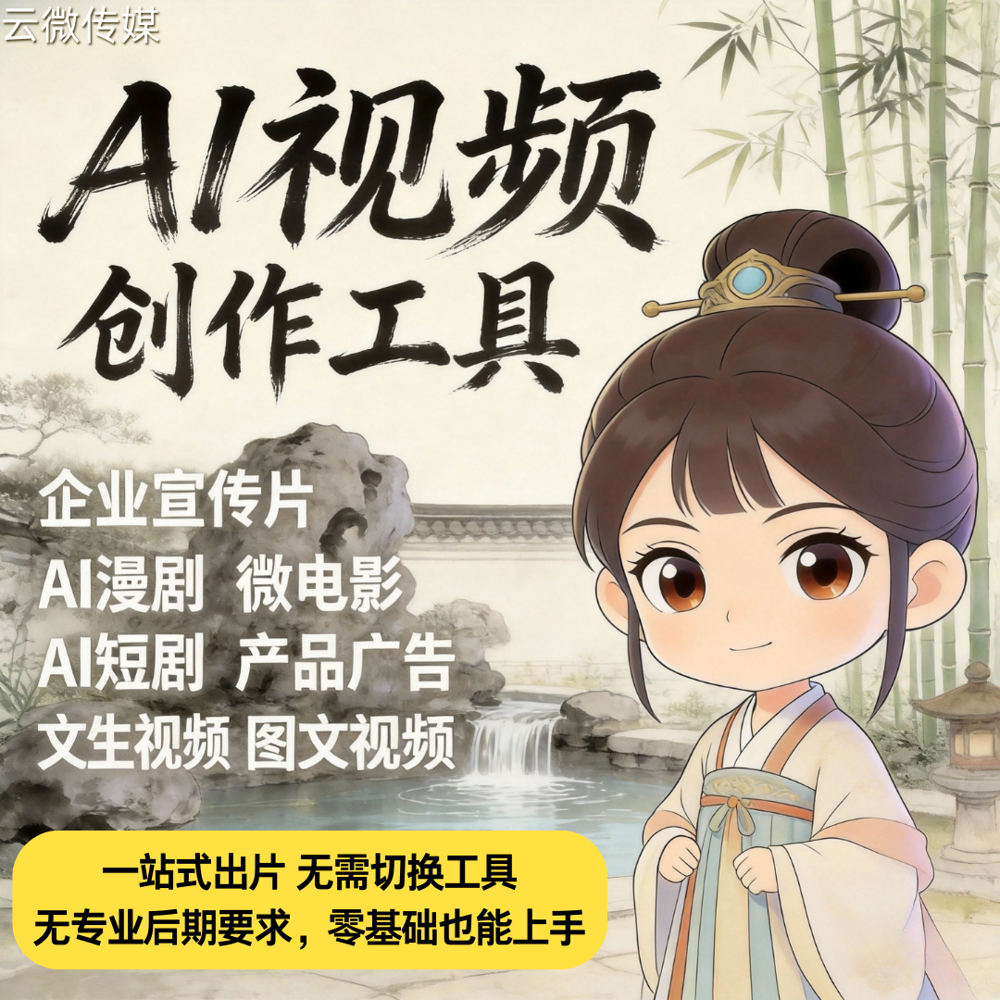

# 零门槛做短剧：AI短剧创作系统｜全自动生成剧本、配音、视频，一键成片

谁还在为短剧熬大夜？不用编剧、不用拍摄、不用后期，零门槛就能轻松搞定一条高质量短剧！

### 一、告别传统制作，AI 全自动一条龙

以前做一条短剧，编剧改稿、演员拍摄、后期剪辑，少则几天，多则几周。现在只需要三步：
- **输入题材**：告诉 AI 你想做什么类型（爽文、甜宠、逆袭等）
- **AI 自动生成**：系统秒写剧本、自动配角色和场景、智能合成配音
- **一键成片**：自动剪辑、加字幕、配特效，高清视频直接导出

### 二、四大核心优势，碾压传统模式

- ✅ **零门槛**：无任何技术基础也能操作，小白也能快速上手
- ✅ **超低成本**：省去几十万人力和设备成本，单人即可运营
- ✅ **高效率**：几分钟产出一条，一天轻松几十上百条
- ✅ **多形态**：支持短剧、漫剧、剧情短视频，适配多平台分发

### 三、广州云微传媒，让你轻松入局

- 成熟稳定的 AI 短剧创作系统，开箱即用
- 支持贴牌、独立部署，数据安全可控
- 广州本地团队，可上门对接、演示、培训
- 长期技术支持，创业不踩坑

## 商务微信：ywyy6798

零门槛做短剧，不是梦想，是现实！

借助 AI 短剧创作系统，全自动生成剧本、配音、视频，一键成片，让你以最低成本，抓住 AI 内容变现风口。

