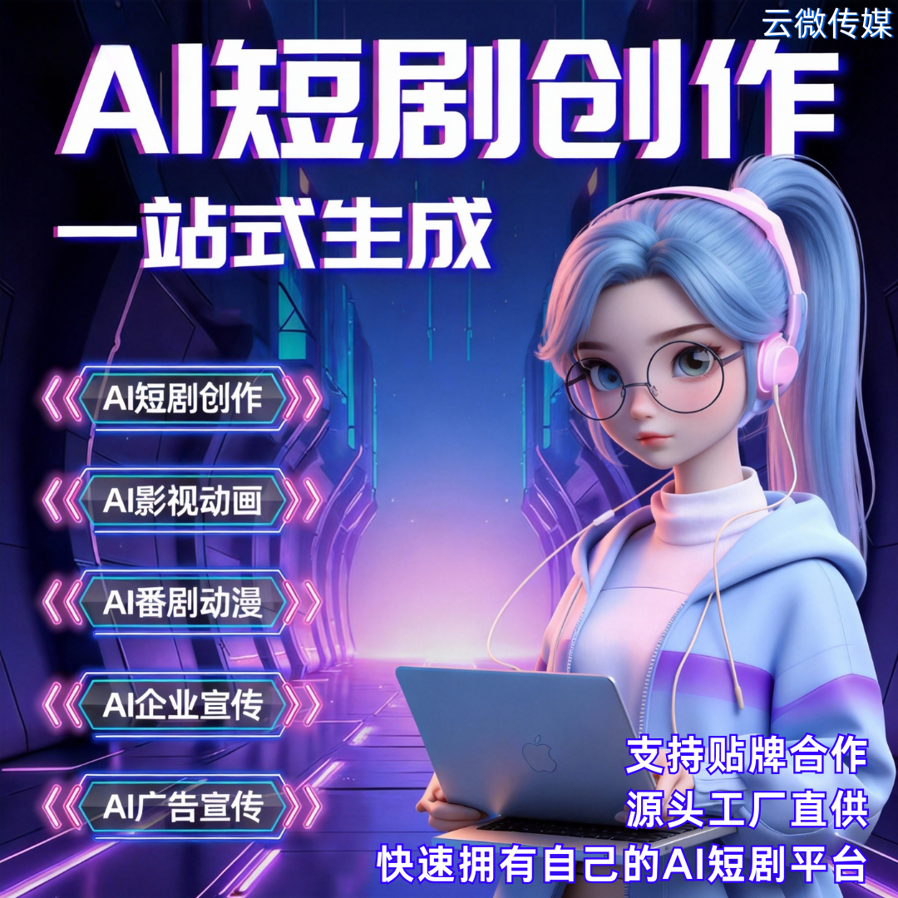

# AI短剧创作系统核心功能｜剧本 + 角色 + 配音 + 出片，全流程自动化

做 AI 短剧不用再凑团队、熬大夜！广州云微传媒 AI 短剧创作系统，4 大核心功能直接把 “编剧 + 画师 + 配音 + 后期” 打包，零技术也能批量出片，小白也能轻松上手～

### 一、核心功能 1：AI 剧本生成，不用熬夜写稿

- ✅ 输入关键词就能出完整剧本（题材：爽文 / 甜宠 / 逆袭 / 古风等，时长可自定义）
- ✅ 自动拆分分镜、撰写台词，逻辑通顺、节奏紧凑，贴合短视频调性
- ✅ 支持批量生成，一天轻松出几十组剧本，再也不用愁内容荒
- ✅ 可手动修改优化，适配自己的运营思路，灵活不僵硬，广州云微传媒全程提供功能适配指导

### 二、核心功能 2：AI 角色创建，不用找演员、画人设

- ✅ 自定义角色形象、发型、服饰、表情，贴合剧本风格，画风统一
- ✅ 支持固定品牌专属角色，强化记忆点（适合企业、MCN 打造 IP）
- ✅ 自动生成角色动作、神态，无需画师逐帧绘制，省时又省力
- ✅ 多风格可选（写实 / 动漫 / 古风），适配不同短剧类型需求，广州本地可对接云微传媒上门演示调整

### 三、核心功能 3：AI 语音合成，不用找专业配音

- ✅ 多音色、多情感可选（温柔 / 霸气 / 可爱 / 沉稳），声音自然不机械
- ✅ 自动对口型、调语速，贴合角色人设和台词情绪，无需手动调整
- ✅ 支持多语种、多语速，适配不同场景（旁白 / 角色对话 / 口播）
- ✅ 无版权风险，商用无忧，省去配音费用和沟通成本，广州云微传媒提供正规商用授权

### 四、核心功能 4：AI 自动出片，不用后期剪辑

- ✅ 剧本、角色、配音一键合成，自动加字幕、配背景音乐、做转场特效
- ✅ 几分钟产出一条高清成片，直接适配抖音、快手、视频号，一键导出发布
- ✅ 支持批量出片，单人可支撑多账号矩阵日更，产能翻倍
- ✅ 成片质量稳定，规避人工剪辑的误差，不用反复修改，广州云微传媒提供后期技术支持

### 补充：实用加分项（不踩坑）

- **零技术门槛**：可视化操作，小白也能快速上手，不用懂剪辑、不用学算法
- **灵活适配**：支持短剧、漫剧双形态，可搭配矩阵运营，变现更灵活
- **靠谱支撑**：广州云微传媒作为源头技术商，提供贴牌、部署、培训，长期售后，创业不踩坑
- **成本可控**：省去编剧、配音、后期等人力成本，轻资产启动，广州本地可上门对接落地

## 商务微信：ywyy6798

AI 短剧创作的核心，就是把复杂流程简化！

剧本生成 + 角色创建 + 语音合成 + 自动出片，4 大核心功能一站式搞定，不用凑团队、不用耗时间、不用高投入，一人就能批量出优质短剧，不管是个人创业、工作室降本，还是企业做内容营销，广州云微传媒都能助力轻松适配～

