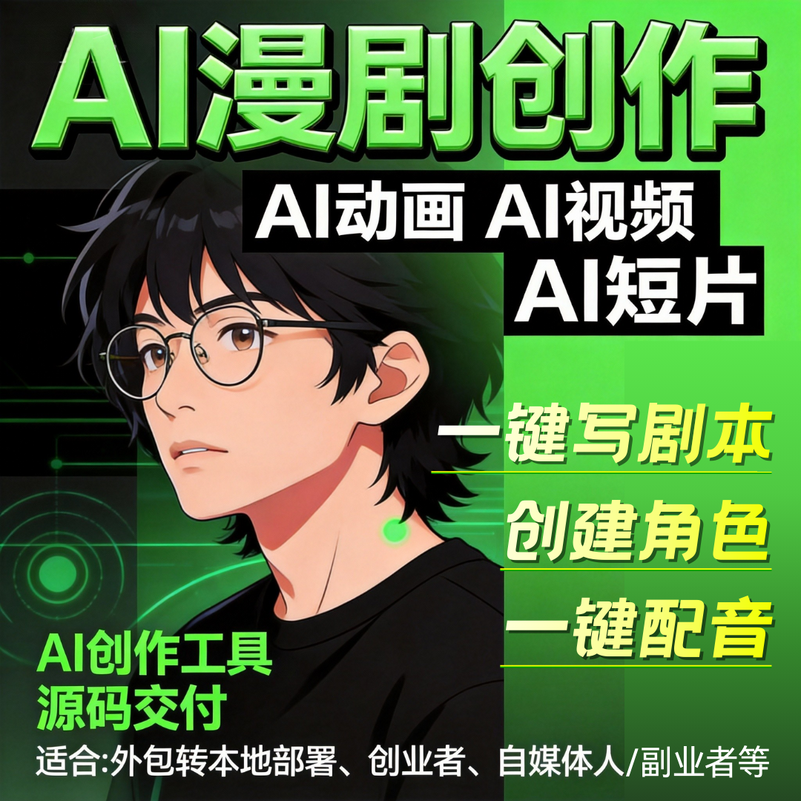

# 想做 AI 短剧创作平台？源头技术支持，1-3 天快速上线

想搭建自己的 AI 短剧创作平台，却卡在研发周期长、技术成本高、团队搭建难？

依托源头成熟技术方案，不用从零开发，1-3 天即可快速上线，个人、团队、企业都能轻松拥有专属平台。

### 一、源头技术直供，省去多年研发成本

- 底层 AI 模型、生成算法、渲染引擎全部成熟封装，不用自研；
- 剧本、画面、配音、剪辑全流程功能现成可用，稳定商用；
- 广州云微传媒源头技术输出，避免踩坑，系统更流畅可靠。

### 二、1-3 天极速部署，上线即运营

- 无需漫长开发周期，环境配置 + 系统安装 + 功能调试一站式完成；
- 部署快、上线快，抓住风口不拖延，当天即可测试出片；
- 支持小程序、H5、APP 多端适配，一套后台统一管理。

### 三、品牌全定制，打造自有平台

- 支持自定义 LOGO、品牌名称、独立域名、UI 界面；
- 无第三方标识，对外完全展示自主品牌，提升信任与实力；
- 可做招商、贴牌、代理，拓展更多盈利模式。

### 四、零技术门槛，运营即可上手

- 后台简洁可视化，不用懂代码、不用懂服务器；
- 批量生成、矩阵管理、数据统计功能齐全，操作简单；
- 提供一对一培训与教程，新手也能快速独立运营。

### 五、独立部署更安全，长期发展有保障

- 支持私有化部署，数据、用户、内容完全自己掌控；
- 可升级源码交付，支持二次开发，适配后期业务扩张；
- 持续系统迭代，紧跟平台政策与行业趋势。

## 🤝 商务微信：ywyy6798

做 AI 短剧创作平台，不必苦等研发、重资投入。

源头技术加持，1-3 天快速上线，低成本、低风险、高可控，既能快速入局变现，也能打造长期品牌，是当下切入 AI 短剧赛道的最优选择。

