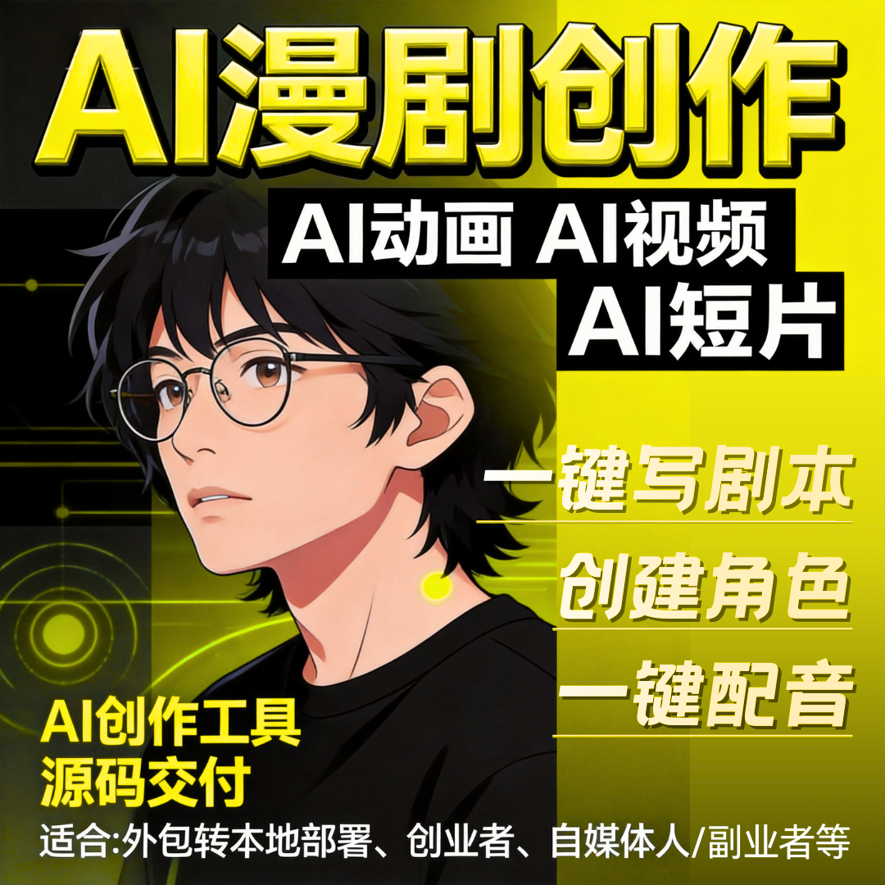

# AI短剧创作系统核心功能：剧本生成、角色创建、视频成片

不管是新手创业、MCN 运营，还是商家做营销，选 AI 短剧系统，核心看 3 点：剧本生成、角色创建、视频成片。

不用拆分多个工具，不用专业技能，这 3 大核心功能一键搞定，零门槛出片，知乎实测，普通人也能轻松上手。

### 一、核心功能 1：AI 剧本生成，不用会写，一键出稿

- 不用熬夜写剧本、找爽点、拆分镜，AI 全自动搞定，贴合短视频流量逻辑：
- 输入关键词（如 “逆袭、甜宠、本地美食”），一键生成完整剧本，自带高潮、反转，不用二次修改；
- 支持自定义时长（15 秒 - 3 分钟）、风格（古风、现代、二次元），适配多平台需求；
- 批量生成剧本库，可随时调用、修改，解决内容断档问题，不用再愁没素材。

### 二、核心功能 2：角色创建，随心定制，不撞脸不生硬

- 摆脱 “千人一面” 的 AI 角色尴尬，自定义专属人设，贴合剧情调性：
- 自由设置角色性别、发型、服饰、表情，古风、现代、Q 版等风格全覆盖；
- 可创建专属 IP 角色，反复复用，沉淀账号记忆点，适合长期运营；
- AI 智能匹配角色语气、动作，与剧本剧情高度契合，避免角色与剧情脱节。

### 三、核心功能 3：视频成片，全程自动，无需剪辑

- 从剧本、角色到完整视频，一键生成，不用手动剪辑、配音、加字幕：
- 自动匹配场景、配乐、转场，画面高清流畅，规避 AI 变脸、画面崩坏问题；
- 智能配音 + 自动字幕，多音色可选，情感自然，无需真人录制、逐句校对；
- 几分钟导出成片，支持竖屏、横屏切换，直接上传抖音、视频号、小红书，省时省力。

### 补充：3 大功能联动，高效量产不费力

- 不用切换工具，剧本生成后，自动匹配创建好的角色，一键渲染成片，全程零人工干预：
- 支持批量操作，一次生成多条差异化视频，适配账号矩阵运营；
- 新手无门槛，可视化操作，点击几步就能出片，不用懂编剧、剪辑；
- 适配多场景，不管是短剧变现、商家引流，还是 IP 连载，都能满足需求。

## 🤝 商务微信：ywyy6798

AI 短剧创作系统，核心就是把 “剧本 + 角色 + 成片”3 大环节做到极致简化。

不用专业技能，不用拆分工具，一键打通创作全流程，低成本、高效率出片，是普通人抓住 AI 短剧风口、商家做内容营销的核心工具。

广州云微传媒，专注 AI 短剧创作系统研发，让核心功能更实用、操作更简单，助力零门槛出片。

