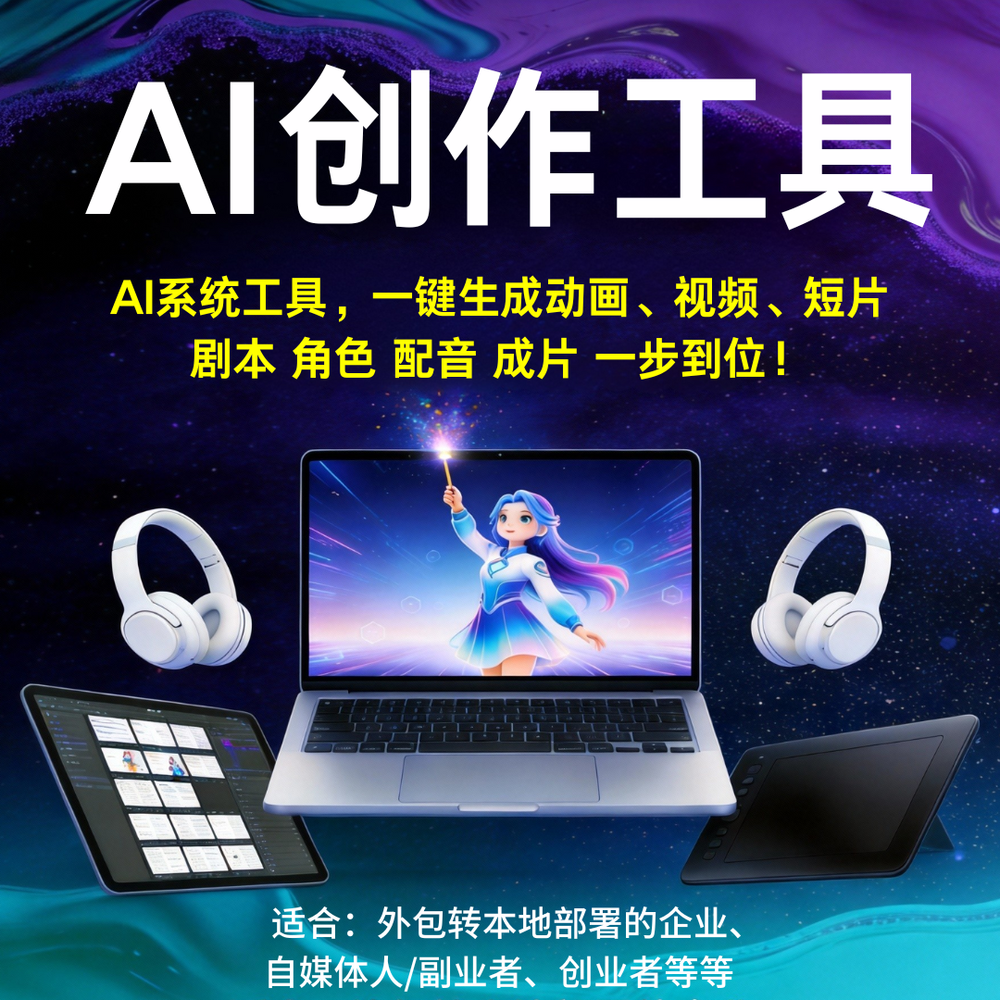

# AI创作工具 | 一键生成动画视频剧本 零基础可商用 支持本地部署

专注AI创作工具开发，一站式解决自媒体人、创业者、企业商家、外包转部署企业的内容创作痛点。摒弃传统动画视频制作“外包成本高、本地部署难、技术门槛高”的困境，无需懂剪辑、建模、编剧，一键生成剧本、角色、配音、成片，全程零技术操作，支持私有化本地部署，内置正版可商用素材，助力各类客户低成本、高效率产出高质量内容，轻松实现创作变现、摆脱外包依赖。

### 一、核心定位：精准适配四大目标客群，一站式创作解决方案

-  **自媒体人** ：零基础快速出片，轻松实现日更，摆脱内容创作瓶颈，助力涨粉变现；
-  **创业者/副业者** ：无需组建专业团队、不用投入高价设备，一人搞定全流程创作，低成本启动内容创业、承接接单业务；
-  **企业商家** ：快速制作品牌宣传、产品推广类动画/视频，内置正版素材可直接商用，降低营销创作成本；
-  **外包转本地部署企业** ：支持私有化本地部署，数据自主可控，摆脱对外包的依赖，自主把控内容质量与创作节奏。

### 二、核心优势：一键解锁创作自由，直击全流程痛点

#### 1. 全品类内容一键生成，覆盖创作全需求

-  **多形态内容适配** ：一键生成短视频、剧情短片、2D/3D动画，适配自媒体、企业宣传、副业接单等多场景；
-  **全链路自动化** ：输入简单需求或关键词，系统自动创作专属剧本，智能匹配角色形象、场景画面；
-  **配音字幕同步** ：生成情绪贴合的多音色AI配音，字幕自动同步匹配画面，无需多工具切换，一个平台搞定全流程。

#### 2. 零基础易操作，上手无门槛，全员可驾驭

-  **可视化简易界面** ：全程鼠标点选操作，无需专业创作知识，不用学习PR、AE、建模软件；
-  **快速上手适配** ：新手培训5分钟即可独立操作，无需技术人员值守，省时省力；
-  **轻量化创作** ：摆脱设备、人力限制，随时随地开启创作，轻松应对日更、接单、批量产出需求。

#### 3. 支持外包转本地部署，企业专属保障

-  **私有化本地部署** ：数据本地存储，保障内容版权与数据安全，彻底摆脱对外包的依赖；
-  **定制化适配** ：可根据企业需求，定制功能模块，适配企业专属创作场景，提升内容创作自主性；
-  **降本增效** ：大幅降低企业长期外包的时间与资金成本，自主把控创作节奏，提升内容产出效率。

#### 4. 高质感可商用，变现无顾虑

-  **正版素材加持** ：内置正版无版权素材库、字体库、音效库，生成内容可直接商用，杜绝版权纠纷；
-  **专业质感输出** ：内容质感媲美专业创作团队，不管是自媒体变现、副业接单，还是企业品牌推广，都能直接使用；
-  **灵活修改优化** ：支持自由修改剧本、角色、配音、画面等细节，贴合个性化创作需求。

#### 5. 高效批量创作，提升变现效率

-  **批量生成功能** ：支持批量导入创作需求，一键生成多条内容，大幅提升创作效率；
-  **适配规模化运营** ：自媒体人轻松实现日更，副业者可承接更多订单，企业快速完成品牌内容布局；
-  **省时省力省成本** ：将传统创作几天的工作量压缩至几分钟，效率提升数倍，大幅降低人力与时间成本。

### 三、合作保障：实体公司，全程护航，放心合作

-  **专业技术团队** ：深耕AI创作工具开发多年，系统稳定无卡顿，适配各类创作场景；
-  **全流程服务** ：从需求沟通、部署指导（本地部署/成品启用），到售后维护、功能升级，一站式对接；
-  **灵活交付模式** ：支持成品直接启用、源码交付+本地部署，按需匹配不同客户需求；
-  **实体对接保障** ：正规实体技术公司，支持随时面谈，签订正式合同，权益有保障，杜绝虚拟团队风险；
-  **售后无忧** ：及时解决操作、部署、创作中的各类问题。

### 四、商务对接：低成本入局，解锁创作变现新方式

系统价格灵活可议，支持成品快速启用、本地部署、定制化开发，按需匹配不同预算与需求，零基础也能玩转动画、视频、短片创作。

## 商务微信：ywyy6798

