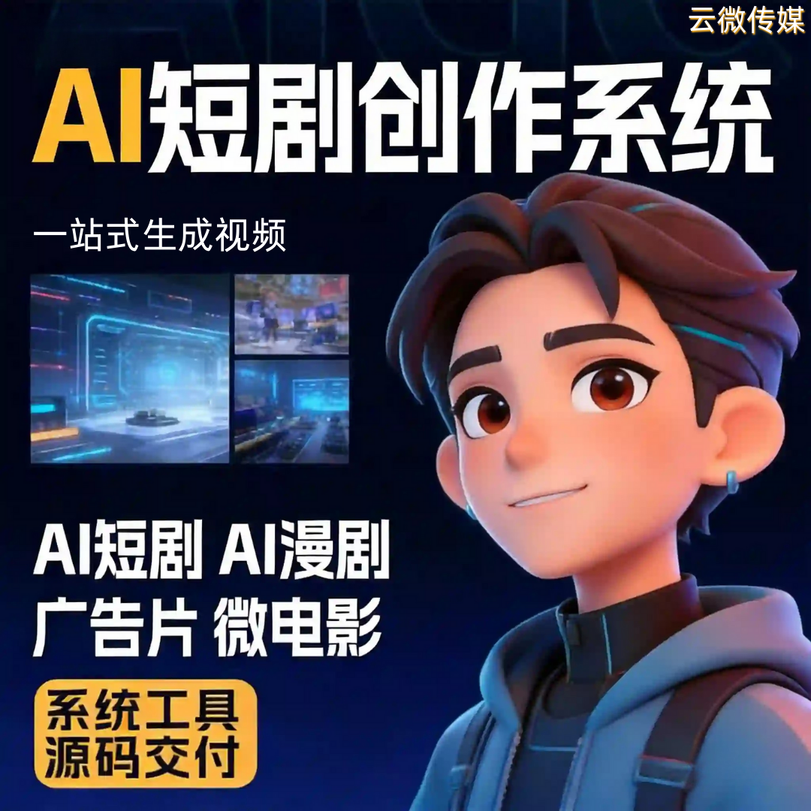

# 大模型AI短剧创作系统 | 一站式剧本到成片 高效量产 源码可定制

依托多模态大模型深度赋能，打造专业AI短剧创作系统，彻底重构传统短剧/漫剧创作模式，破解“门槛高、周期长、量产难、质量不稳”四大核心痛点。具备剧本解析、智能分镜、风格匹配、全流程自动化生成能力，实现从文案到成片一站式创作，适配自媒体、工作室、企业商家、创业者等多类客群，助力低成本实现规模化内容产出与商业变现，源码可交付、支持私有部署与二次开发。

### 一、传统创作痛点直击：为何亟需大模型AI系统？

短剧漫剧赛道流量爆发，但传统创作模式难以适配规模化、高效化需求，成为盈利与入局阻碍：

-  **门槛高** ：需专业编剧、分镜、剪辑能力，零基础难入局，学习与试错成本高；
-  **周期长** ：人工制作单条内容动辄数小时，错失平台热点流量窗口；
-  **质量不稳** ：人工拼接易出现画风割裂、节奏混乱，难以打造统一账号/品牌调性；
-  **量产受限** ：人工产能有天花板，批量接单、多账号矩阵运营时，人力成本飙升、交付滞后。

### 二、大模型核心赋能：四大核心创作能力，懂剧情更会创作

#### 1. 深度语义解析，精准吃透剧本内核

- 依托强大NLP能力，自动解析长文本剧本，识别剧情主线、人物情绪、场景转换与叙事节奏；
- 精准匹配悬疑、甜宠、古风、都市、重生等题材风格，杜绝画面与文案脱节，内容贴合剧情氛围。

#### 2. 智能分镜设计，还原专业创作逻辑

- 大模型推理生成专业分镜，自动拆分镜头序列、规划转场方式与镜头时长，模拟专业编导思路；
- 生成内容节奏流畅、叙事清晰，观感接近人工精剪，彻底摆脱杂乱AI拼接感。

#### 3. 多模态素材匹配，画风统一质感在线

- 结合视觉大模型与海量合规素材库，自动匹配场景、人物、背景音乐，保证画风与情绪连贯；
- 适配写实短剧、二次元漫剧、动态图文漫剧等多种形式，风格统一不出戏，质感稳定可控。

#### 4. 情感化AI配音，沉浸感拉满

- 搭载大模型驱动的情感TTS，根据角色身份、台词情绪分配音色、调节语速停顿；
- 支持旁白、角色对话、内心独白差异化配音，人声与剧情深度贴合，提升内容传播力。

### 三、全场景适配：精准匹配四大核心客群

-  **自媒体/创业者** ：零门槛上手，3分钟一键出片，支持批量创作，轻松实现日更、起号涨粉、副业接单；
-  **内容工作室** ：批量导入剧本、多风格差异化输出，提升产能与交付效率，承接更大订单、扩大利润空间；
-  **企业商家** ：定制品牌风格，植入产品信息，生成剧情化营销短剧，软性传播品牌、提升转化；
-  **技术服务商** ：支持大模型基座对接、私有部署、二次开发与功能定制，满足本地化、自主可控需求。

### 四、合作保障与交付优势

-  **技术保障** ：深耕大模型多模态应用，系统稳定无卡顿，内容生成质量持续优化迭代；
-  **灵活交付** ：支持成品快速启用、源码全量交付，适配私有部署与二次开发，数据自主可控；
-  **全流程服务** ：需求沟通、方案定制、部署指导、售后维护一站式对接；
-  **实体对接** ：正规实体公司，支持面谈，签订正式合同，杜绝虚拟团队风险，权益有保障。

### 五、商务对接：抢占大模型短剧流量红利

系统价格灵活可议，按需提供成品部署、定制化开发、私有部署方案，适配不同预算，助力快速入局短剧赛道，依托大模型技术构建核心竞争力。

## 商务微信：ywyy6798

